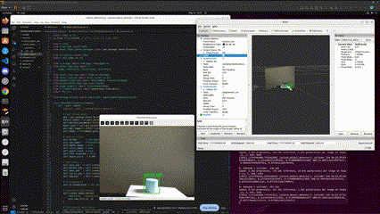
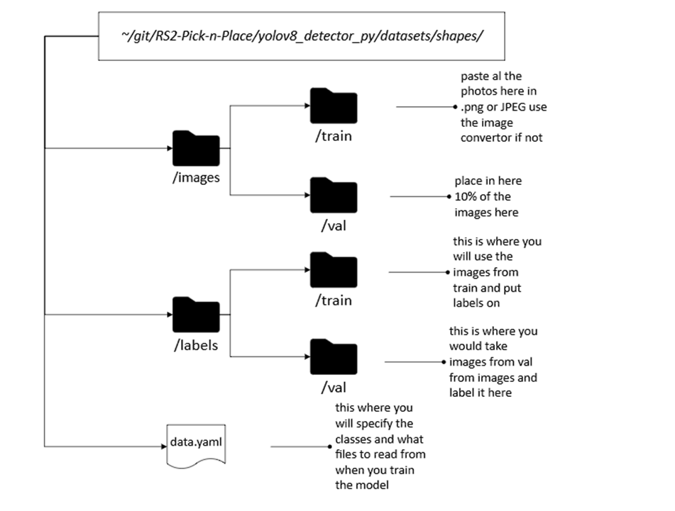

# Perception Subsystem – ROS 2 (YOLOv8 + RealSense D435 Integration)

This branch provides a real-time perception pipeline for robotic pick-and-place, combining an Intel RealSense RGB-D camera with YOLOv8 object detection in ROS 2.  It publishes 2D and 3D object localization, segmented point clouds, and live visualization topics for integration with downstream planning and manipulation subsystems.

## Purpose

Detect and localize objects in real time using YOLOv8 and an Intel RealSense camera.  
Outputs 3D poses and segmented point clouds for downstream manipulation and planning.




---

## Table of Contents

- [Purpose](#purpose)
- [Hardware](#hardware)
- [Key Topics](#key-topics)
- [Installation and Setup](#installation-and-setup)
- [Subsystem Demonstration in Real Life](#subsystem-demonstration-in-real-life)
- [Testing](#Testing)
- [Configurable Settings](#Configurable-Settings)
- [Troubleshooting & FAQs](#troubleshooting--faqs)
- [References](#References)

---
## Hardware

| No. | Category | Item                                     | Qty | Purpose                                        | Notes/Part No.                         |
|-----|----------|------------------------------------------|-----|------------------------------------------------|----------------------------------------|
| 1   | Camera   | Intel RealSense Depth Camera D435        | 1   | Colour + depth sensing for object detection & point cloud | Refer to (Intel RealSense, 2025)       |
| 2   | Camera   | Articulated tripod / desk stand          | 1   | Allows strategic positioning                   | Refer to (Intel RealSense, 2025)       |
| 3   | Camera   | USB-C to USB-A 3.0 cable                 | 1   | To connect camera to computer                  | Refer to (Intel RealSense, 2025)       |
| 4   | Camera   | Calibration checkerboard (8×6, 20 mm)    | 1   | Eye-to-hand extrinsic calibration              | 8×6 inner corners, 20 mm squares       |

---

## Key Topics

| Type        | Topic                                | Description                                      |
|-------------|--------------------------------------|--------------------------------------------------|
| Subscribes  | `/camera/color/image_raw`            | RGB image stream (input to YOLOv8)               |
| Subscribes  | `/camera/aligned_depth_to_color/image_raw` | Aligned depth image                        |
| Subscribes  | `/camera/depth/color/points`         | Organized point cloud                            |
| Subscribes  | `/camera/color/camera_info`          | Camera intrinsics                                |
| Publishes   | `/detected_object_pose`              | 3D pose of detected object(s)                    |
| Publishes   | `/roi_marker`                        | Sphere marker for object centroid                |
| Publishes   | `/obb_marker`                        | Cube marker for bounding box (3D)                |
| Publishes   | `/segmented_roi`                     | Segmented point cloud for detected object        |
| Publishes   | `/yolo/image`                        | Annotated image with detection overlays          |

---

## Installation and Setup

### 1. Switch to the Perception Branch
```bash
cd ~/git/RS2-Pick-n-Place
git checkout Perception
```

### 2. Symlink only the yolov8_object_detector package into your ROS 2 workspace:
```bash
cd ~/ros2_ws/src
ln -s ~/git/RS2-Pick-n-Place/yolov8_object_detector yolov8_object_detector
```
If you switch branches, remove the symlink before linking a different version.

### 3. Install Required Python Packages
```bash
pip3 install --user ultralytics onnx onnxruntime ros2_numpy opencv-python
```
### 4. Install Required ROS 2 Packages
```bash
sudo apt update
sudo apt install ros-humble-cv-bridge ros-humble-tf-transformations
sudo apt install ros-humble-librealsense2* ros-humble-realsense2-camera
```

### 5. Install and Configure the RealSense ROS 2 Wrapper
```bash
sudo usermod -a -G dialout $USER
wget -O ~/99-realsense.rules https://raw.githubusercontent.com/IntelRealSense/librealsense/master/config/99-realsense-libusb.rules
sudo mv ~/99-realsense.rules /etc/udev/rules.d/
sudo udevadm control --reload-rules && sudo udevadm trigger
```
Note: You may need to log out and back in for group permissions to take effect.

---
## Subsystem Demonstration in Real Life

### 1.	In Terminal A, launch the real sense node
```bash
ros2 launch realsense2_camera rs_launch.py \
  align_depth.enable:=true \
  pointcloud.enable:=true \
  depth_module.profile:=640x480x30
```

### 2.	In Terminal B, Run the YOLOv8 Object Detector Node
```bash
cd ~/ros2_ws
colcon build --packages-select yolov8_object_detector
source install/setup.bash	
ros2 run yolov8_object_detector object_detector.py
```
---

## Testing

### Testing Detections on Static Images
You can quickly verify YOLOv8’s performance on your own sample images without launching ROS 2.

1. **Prepare your test images** 
Place any `.jpg/.jpeg/.png` files under: ~/git/RS2-Pick-n-Place/yolov8_object_detector/Test

2. **Run the offline Detector**
```bash
cd ~/git/RS2-Pick-n-Place/yolov8_object_detector/Test
./test_detector.py \
  --model ../models/shapes/best.onnx \
  --input sample/ \
  --output_dir results/ \
  --conf 0.5 \
  --iou 0.45
```
- model: path to your best.onnx

- input: folder of test images

- output_dir: where annotated images will be saved

- conf / --iou: detection thresholds

4. **Review Results** 
Annotated outputs (*_det.jpg) and printed counts will appear in results/.
You can tweak --conf and --iou to see how confidence and NMS thresholds affect detections.

---

## Configurable Settings

## How to train models using YOLOv8

1. Create a folder structure like this anywhere in your Ubuntu system


2.	Pasting in the pictures
Split 80/20: put ~80% of your images in train/ and ~20% in val/

3. Install LabelImg if you haven’t already
```bash
pip3 install labelImg
```

4. Launch it
```bash
labelImg
```
5. Open your images/train/ folder, set the save directory to labels/train/, switch to “YOLO” format, and draw bounding boxes around each object, choosing the correct class name (cube or cylinder).

6. Repeat for images/val/ → labels/val/.

7. At the root of yolov8_retrain/, make a file data.yaml
```Bash
# data.yaml
train: images/train # Directory for 100% images
val:   images/val # Directory for 20% images

nc: 2 # Number of Classes
names: ['cube', 'cylinder'] # Names of the Classes
```

8. From inside yolov8_retrain/
```bash
yolo train \
  model=yolov8n.pt \         # start from tiny-small model; switch to v8s.pt or v8m.pt for more capacity
  data=data.yaml \
  epochs=100 \               # increase if loss is still decreasing
  imgsz=640 \                # image size
  batch=16 \                 # lower if you run out of GPU/CPU RAM
  augment=True \             # random flip/mosaic/HSV augmentations
  name=cube_cyl_retrain      # results will go under runs/train/cube_cyl_retrain
```

9. Evaluate 
```bash
yolo val model=runs/train/cube_cyl_retrain/weights/best.pt data=data.yaml
```

This will print mAP@0.5, precision, recall.

10. Esport to ONNX/TF if desired (you can use this for your perception node!)
```bash
yolo export model=runs/train/cube_cyl_retrain/weights/best.pt format=onnx
```

---

## Troubleshooting & FAQs

### 1. Experiencing USB Permission Issues?

| Step | Command / Action                                                                                                                                                                                                                                                     | Description                                                                  |
|------|------------------------------------------------------------------------------------------------------------------------------------------------------------------------------------------------------------------------------------------------------------------------|------------------------------------------------------------------------------|
| 1    | ```bash<br>sudo usermod -a -G dialout $USER<br>```                                                                                                                                                                                                                     | Add your user to the dialout group to grant serial and USB device access.    |
| 2    | ```bash<br>sudo reboot<br>```                                                                                                                                                                                                                                          | Logout/login or reboot (especially on WSL or VM) to apply group changes.     |
| 3    | ```bash<br>sudo wget -O /etc/udev/rules.d/99-realsense-libusb.rules https://raw.githubusercontent.com/IntelRealSense/librealsense/master/config/99-realsense-libusb.rules<br>```                                       | Download and install Intel RealSense udev rules so camera permissions load automatically. |
| 4    | ```bash<br>sudo udevadm control --reload-rules && sudo udevadm trigger<br>```                                                                                                                                                                                           | Reload udev rules and trigger them immediately.                              |


---

### 2. Issues with Camera Display or OpenCV GUI?

You may see errors or black windows in RViz, `rqt_image_view`, or other OpenCV-based GUIs—especially inside a VM.

| Step | Action                                                                                                                                                                                                                                                                                       | Details                                                                                                                                                   |
|------|----------------------------------------------------------------------------------------------------------------------------------------------------------------------------------------------------------------------------------------------------------------------------------------------|-----------------------------------------------------------------------------------------------------------------------------------------------------------|
| 1    | **Switch to Xorg**<br>- At Ubuntu’s login screen, click the ⚙️ (gear) icon or session menu near the password field.<br>- Select **“Ubuntu on Xorg”** (or “Ubuntu on X11”), then log in.                                                                                                       | Wayland-based sessions often block or misrender GUI windows in VMs.                                                                                       |
| 2    | **Enable Xorg in GDM (if no gear icon)**<br>- Edit `/etc/gdm3/custom.conf` as root.<br>- Uncomment the line:<br>  ```ini<br>  #WaylandEnable=false<br>  ```<br>- Save and reboot.                                                                                                            | Forces GDM to disable Wayland and use Xorg by default.                                                                                                   |
| 3    | **Verify your session type**<br>```bash<br>echo $XDG_SESSION_TYPE<br>```                                                                                                                                                                                                                       | Should print `x11`. If it prints `wayland`, log out and redo step 1.                                                                                       |

---

## References

Check out the [Intel RealSense](https://www.intelrealsense.com/depth-camera-d435/) for more details.


