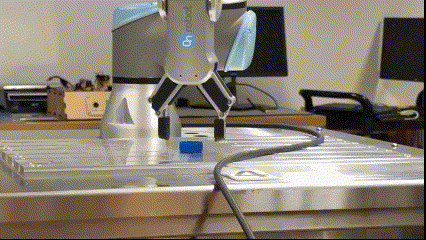

# Subsystem Setup – Gripper – ROS2



## 📑 Table of Contents

- [Purpose](#purpose)  
- [Key Topics](#key-topics)  
- [Installation and Setup](#installation-and-setup)  
- [Hardware Setup](#hardware-setup)  
- [Subsystem Demonstration in Real Life](#subsystem-demonstration-in-real-life)
- [References](#References)

---

## Purpose

The gripper subsystem enables the robot to pick up and manipulate objects reliably by integrating and controlling the OnRobot RG2 gripper with the UR3e robot arm in ROS 2.

---

## Key Topics

| Type         | ROS Topic / Component                                    | Description                                           |
|--------------|----------------------------------------------------------|-------------------------------------------------------|
| Subscribed   | `/finger_width_controller/commands`                      | Control gripper opening (meters, `Float64MultiArray`) |
| Published    | `/joint_states`                                          | Current state of UR3e + RG2 (includes gripper)       |
| Launch files | `ur_onrobot_description`                                 | Robot+gripper URDF for RViz/Gazebo                   |
| Launch files | `ur_onrobot_control`                                     | ROS 2 controllers and hardware integration            |
| Launch files | `ur_onrobot_moveit_config`                               | MoveIt! configuration for motion & grasp planning     |
---

## Installation and Setup

1. Clone the OnRobot ROS 2 Integration Packages
```bash
cd ~/ros2_ws/src
git clone https://github.com/tonydle/UR_OnRobot_ROS2.git ur_onrobot
```
2. Fetch OnRobot Dependencies
```bash
cd ~/ros2_ws
vcs import src --input src/ur_onrobot/required.repos --recursive
```

3. Install Required System Packages
```bash
sudo apt update
sudo apt install libnet1-dev
```

4. Install ROS 2 Dependencies
```bash
rosdep update
rosdep install -y --from-paths src --ignore-src
```

5. Build and Source the Workspace
```bash
colcon build --symlink-install
source install/setup.bash
```
---

## Hardware Setup

1. Physically connect the gripper
2. Attach the OnRobot RG2 (via the Quick Changer) to the Tool I/O port on your UR3e.
3. Refer to the OnRobot README, See: https://github.com/tonydle/UR_OnRobot_ROS2
4. Configure Tool I/O on the UR Teach Pendant
	- Installation → General → Tool I/O:
		- Controlled by: User
		- Communication Interface: RS485 (Modbus)
		- Baud Rate: 1M, Parity: Even, Stop Bits: One
		- Tool Output Voltage: 24V
		- Digital Output 0/1: Sinking (NPN)
---

## Subsystem Demonstration in Real Life

1. View URDF in RViz
```bash
ros2 launch ur_onrobot_description view_robot.launch.py \
  ur_type:=ur3e onrobot_type:=rg2
```

2. Start the Robot with Gripper Driver
```bash
ros2 launch ur_onrobot_control start_robot.launch.py \
  ur_type:=ur3e \
  onrobot_type:=rg2 \
  robot_ip:=<robot_ip>
Replace <robot_ip> with your robot’s IP, or use
robot_ip:=fake use_fake_hardware:=true for simulation/testing.
```

3. Start MoveIt!
```bash
ros2 launch ur_onrobot_moveit_config ur_onrobot_moveit.launch.py \
  ur_type:=ur3e onrobot_type:=rg2
```

4. Check Joint States (including gripper)
```bash
ros2 topic echo /joint_states
```
You should see six UR3e joint values plus finger_width.

5. Control the Gripper via ROS 2 Topic
```bash
ros2 topic pub --once /finger_width_controller/commands \
  std_msgs/msg/Float64MultiArray "{data: [0.05]}"
```
  
---

## References
1. Check out the [RG2 Onrobot Datasheet](https://tech-labs.com/sites/default/files/Datasheet_RG2_v1.4_EN.pdf) for more details.

2. Check out the [Series Mounted with OnRobot Grippers](https://github.com/tonydle/UR_OnRobot_ROS2?tab=readme-ov-file) for more details.

3. Check out the [RG2 User Manual](https://onrobot.com/sites/default/files/documents/RG2_User%20_Manual_enEN_V1.9.2.pdf) for more details.


---
